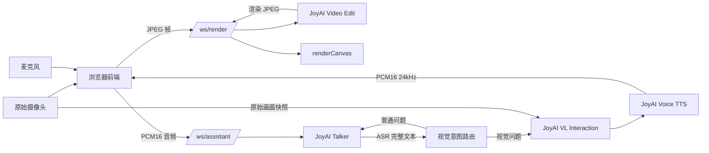

# 项目概览与架构

## 1. 项目目标

ParallelVerse 是一个摄像头实时交互演示应用，当前包含四类模型能力：

1. **JoyAI Video Edit**：将摄像头帧实时转换为生成式渲染画面。
2. **JoyAI Talker**：接收麦克风 PCM16 音频，提供 ASR、普通问答和语音回复。
3. **JoyAI VL Interaction**：根据当前原始摄像头画面回答视觉问题。
4. **JoyAI Voice**：将 Interaction 或演示 Mock 的最终文本转换为 PCM16 音频。

## 2. 系统结构

## 3. 关键设计

### Video Edit 与视觉理解相互隔离

- Video Edit 输入来自 `cameraVideo`，输出绘制到 `renderCanvas`。
- 页面开启“穿越”后展示 `renderCanvas`。
- Interaction 的快照始终从 `cameraVideo` 获取。
- 因此视觉理解分析的是原始摄像头，而不是生成后的 Video Edit 画面。

### 视觉路由由服务端确定

Talker 完成 ASR 后，`app/visual_router.py` 根据完整文本判断：

- 普通知识与聊天问题继续由 Talker 回答。
- 明确涉及画面、镜头、穿搭、位置、人物数量等问题调用 Interaction。
- 视觉追问可根据上一条视觉上下文继续调用 Interaction。

### 视觉回答不交给 Talker 改写

Interaction 成功结果会：

1. 显示在右下角视觉解析卡片。
2. 显示在中央助手字幕。
3. 原文发送给 JoyAI Voice，通过 `tts_text` 朗读。

这样可以避免 Talker 对视觉结果二次改写或产生不存在的画面描述。

## 4. 前端层级

- `cameraVideo`：原始摄像头视频。
- `renderCanvas`：Video Edit 输出。
- `captureCanvas`：向 Video Edit 编码输入帧的隐藏画布。
- `.ui-layer`：按钮、状态、字幕、视觉结果等交互 UI。

页面已移除四周变暗的 vignette 径向遮罩。

